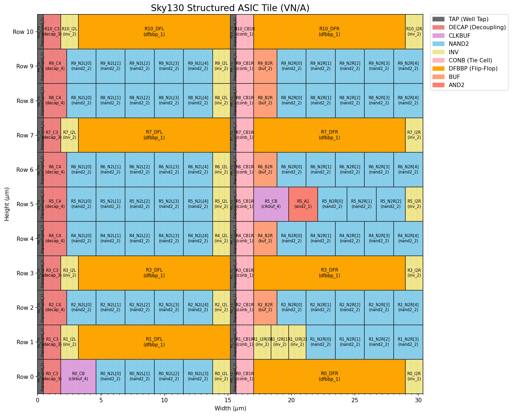
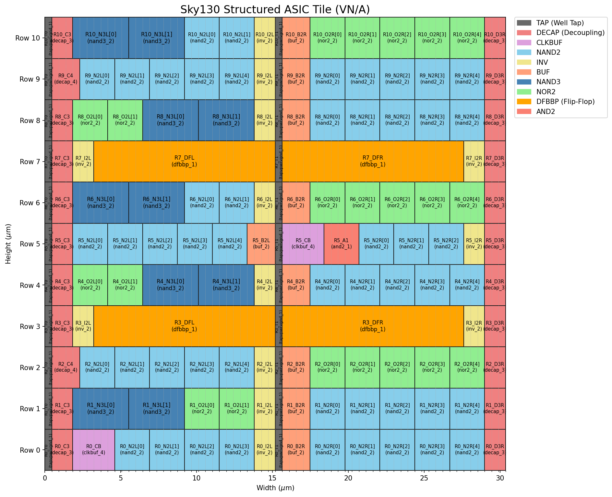

# SASIC — Structured ASIC on Sky130

A structured ASIC fabric and synthesis flow targeting the SkyWater SKY130 HD standard cell library. Each fabric tile provides a fixed arrangement of logic, sequential, and buffer cells that can be programmed via Yosys-based technology mapping — no custom place-and-route required.

## Fabrics

Two fabric tile definitions are included, both using the Sky130 HD standard cell library on a 32x32 tile grid (1,024 tiles).

### `nand2_11x66` — NAND2-Only (default)

Tile: **66 x 11 sites** (30.4 x 29.9 µm)

NAND2-only fabric with balanced cell distribution. Uses only NAND2+INV for combinational logic, with additional DFBBP rows for sequential-heavy designs.



| Cell | Function | Per Tile | Total |
|------|----------|--------:|---------:|
| `nand2_2` | 2-input NAND | 66 | 67,584 |
| `inv_2` | Inverter | 19 | 19,456 |
| `buf_2` | Buffer | 5 | 5,120 |
| `dfbbp_1` | DFF (set/reset) | 8 | 8,192 |
| `conb_1` | Constant 0/1 | 11 | 11,264 |

Infrastructure (not available for synthesis): `clkbuf_4` (clock buffer), `and2_1` (scan chain), `tapvpwrvgnd_1`, `decap_3/4`.

### `fabric_11x66` — Mixed-Gate

Tile: **66 x 11 sites** (30.4 x 29.9 µm)

Mixed-gate variant with NAND2, NOR2, and NAND3 for denser logic packing at the cost of less uniform routing.



| Cell | Function | Per Tile | Total |
|------|----------|--------:|---------:|
| `nand2_2` | 2-input NAND | 51 | 52,224 |
| `nor2_2` | 2-input NOR | 21 | 21,504 |
| `nand3_2` | 3-input NAND | 10 | 10,240 |
| `inv_2` | Inverter | 13 | 13,312 |
| `buf_2` | Buffer | 9 | 9,216 |
| `dfbbp_1` | DFF (set/reset) | 4 | 4,096 |
| `conb_1` | Constant 0/1 | 11 | 11,264 |

Infrastructure: same as nand2_11x66.

## Design Portfolio

15 designs tested across both fabrics. Results below are for the **nand2_11x66** fabric.

| Design | Description | Cells | Util% | Status |
|--------|-------------|------:|------:|--------|
| arith | Arithmetic test | 549 | 0.4% | OK |
| tt_bit_serial_cpu | 8-bit bit-serial CPU | 1,826 | 1.7% | OK |
| tt_spi_pwm | SPI PWM generator | 2,234 | 2.0% | OK |
| vga_glyph_demo | VGA glyph renderer | 2,689 | 2.0% | OK |
| uart_to_spi_bridge | UART-to-SPI bridge | 2,460 | 2.2% | OK |
| 6502 | 6502 microprocessor | 3,514 | 2.9% | OK |
| tt_warp | Demoscene VGA + music | 10,139 | 8.0% | OK |
| z80 | Z80 microprocessor | 12,605 | 9.0% | OK |
| tt_tiny_nn | Neural network inference | 14,819 | 12.1% | OK |
| tt_uart_rv32i | RV32I RISC-V + UART | 21,377 | 21.1% | OK |
| tt_sha256 | SHA-256 processor | 34,438 | 30.0% | OK |
| tt_kianv_rv32ima | RV32IMA uLinux SoC | 37,425 | 35.4% | OK |
| frv32_soc | FemtoRV32 SoC | 53,881 | 59.7% | OK |
| soc | System-on-Chip | 78,369 | 78.7% | OK |
| aes_128 | AES-128 encryption | 121,825 | 106.5% | Over |

14 of 15 designs fit within a single tile array.

## Directory Structure

```
sasic/
  designs/
    src/              Verilog/SV source files (sasic_top wrapper)
    synth/            Synthesis output (mapped .json and .v netlists)
  fabric/
    fabric_11x66.yaml     Mixed-gate tile layout definition
    fabric_11x66.lib      Liberty timing library (7 cells)
    nand2_11x66.yaml      NAND2-only tile layout definition
    nand2_11x66.lib       Liberty timing library (5 cells)
  tech/
    sky130_fd_sc_hd__tt_025C_1v80.lib   Full SKY130 HD Liberty (TT corner)
    sky130_fd_sc_hd.lef                  LEF physical data
    sky130_fd_sc_hd.tlef                 Tech LEF
    techmap_2.v                          Yosys technology mapping rules
  tools/                See tools/README.md for full documentation
    synth.py              Yosys synthesis wrapper
    synthesize_all.sh     Batch synthesis for all designs
    place.py              Placement solver (Hungarian + SA)
    gen_pins_yaml.py      Die-edge pin placement generator
    gen_fabric_cells_by_tile.py   Tile-to-die cell position export
    resource_report.py    Fabric utilization reporting
    draw-tile.py          Tile layout visualization
    draw-fp.py            Interactive floorplan viewer
    visualize_placement.py  Placement visualization
    check_pin_tracks.py   Pin-to-track alignment validation
    check_pin_overlap.py  Pin overlap detection
  docs/                 Flow documentation, design guides, tile images
```

## Quick Start

### Prerequisites

- [Yosys](https://github.com/YosysHQ/yosys) (>= 0.40)
- Python 3.8+ with PyYAML (`pip install pyyaml`)
- matplotlib (optional, for visualization: `pip install matplotlib`)

### Synthesize a single design

```bash
python3 tools/synth.py \
  -d designs/src/arith.v \
  -t sasic_top \
  -l fabric/nand2_11x66.lib \
  -m tech/techmap_2.v \
  --fabric fabric/nand2_11x66.yaml \
  -o designs/synth/arith_nand2_11x66 \
  --flatten -v
```

### Synthesize all designs

```bash
# NAND2-only fabric (default)
./tools/synthesize_all.sh

# Mixed-gate fabric
./tools/synthesize_all.sh fabric_11x66
```

### Generate auxiliary files

```bash
# Pin placement
python3 tools/gen_pins_yaml.py \
  --fabric fabric/nand2_11x66.yaml \
  --out output/pins.yaml

# Cell positions (for placement)
python3 tools/gen_fabric_cells_by_tile.py \
  --fabric fabric/nand2_11x66.yaml \
  --out output/fabric_cells.yaml

# Tile layout image
python3 tools/draw-tile.py fabric/fabric_11x66.yaml -o docs/tile_11x66.png
```

### Wrapping Tiny Tapeout projects

See [docs/tt_wrapping_guide.md](docs/tt_wrapping_guide.md) for instructions on adapting TT-style designs (`tt_um_*`) to the `sasic_top` interface.

## Technology

- **PDK**: SkyWater SKY130 HD (`sky130_fd_sc_hd`)
- **Corner**: TT, 25°C, 1.80V
- **Target**: Caravel Openframe multi-project fabric

## License

Licensed under the Apache License, Version 2.0. See [LICENSE](LICENSE) for details.
